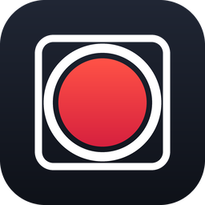
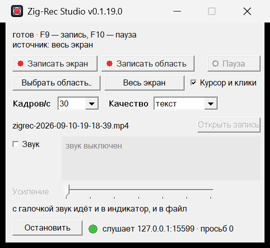

<div align="center">



# Zig-Rec Studio

**Запись экрана в mp4, который открывается везде.**
Один exe на 1,7 МБ, без установки, без зависимостей, без рекламы.

</div>

<div align="center">
  
</div>

---

Нажал клавишу — снял кусок экрана — получил mp4, который без разговоров
открывается в браузере, Windows Media Player, VLC и PowerPoint.

Задумано как замена CamStudio: тот пишет AVI своим кодеком, который на чужой
машине нечем открыть, редактора не имеет и давно заброшен.

Программа живёт в двух формах на одном движке записи: окно и командная строка.
Что задаётся в окне, задаётся и ключом.

## Что умеет

| | |
|---|---|
| **Источник** | весь экран, любой монитор, прямоугольник или окно по части заголовка. Область едет за окном, если его двигают во время записи |
| **Видео** | H.264 через Media Foundation, аппаратным кодировщиком. `moov` в начале файла, поэтому браузер начинает играть, не скачав файл целиком |
| **Звук** | микрофон и звук из колонок — одной дорожкой AAC или двумя врозь, синхронно с картинкой. Выбор микрофона из списка с запоминанием, живой осциллограф, ползунок усиления и проба «пять секунд и прослушать», чтобы услышать себя ещё до записи |
| **Курсор** | захват отдаёт рабочий стол без курсора, поэтому рисуем сами: подсветка под указателем, вспышка на клик разными цветами для левой и правой кнопки |
| **Область видна** | вокруг записываемого прямоугольника идёт мигающая пунктирная рамка — снаружи кадра, в файл она не попадает |
| **Пауза** | не рвёт файл: время простоя вычитается из меток кадров |
| **Синхронность** | десять минут живой записи со звуком колонок: интервал между гудком в начале и в конце разошёлся с секундомером на 8 мс при пороге 20. Часы звуковой карты и часы кадров разные — звук подтягивается понемногу, без щелчков |
| **Горячие клавиши** | F9 — запись, F10 — пауза. Заняты другой программой — программа сама переходит на Ctrl+Alt+F9 и говорит об этом |
| **Трей** | окно можно убрать совсем, работа продолжится |
| **Язык** | русский и английский, переключатель Ru / En в настройках; действует со следующего запуска. Командная строка и самопроверки остаются русскими |
| **Сервер MCP** | записью можно управлять из Claude Code: «сними это окно», «останови», «какой получился файл» |

## Быстрый старт

Скачайте `zigrec.exe` со страницы [релизов](https://github.com/j0k/ZigRec-Studio/releases), запустите — откроется окно. Или из командной строки:

```
zigrec ui                        окно записи (F9 — запись, F10 — пауза)
zigrec ui --tray                 сразу в трее, без окна

zigrec record out.mp4 --sec 10 --area 100,100,1280,720
zigrec record out.mp4 --window "Блокнот" --fps 60 --sound
zigrec monitors                  какие есть мониторы
zigrec windows                   какие есть видимые окна
zigrec --help                    всё остальное
```

Коды возврата: `0` записан, `3` записан с пропусками кадров, `1` не записан,
`2` неверные ключи.

## Управление из Claude Code

В окне есть кнопка **«Сервер MCP»**; рядом лампочка и адрес. Нажали — программа
начала слушать `127.0.0.1:15599`. Сама она порт не открывает никогда.

После этого можно просто просить: «запиши окно браузера со звуком», «останови
запись». Шесть инструментов: начать запись, остановить, спросить состояние,
перечислить мониторы, перечислить окна, взять события последней записи.

Как подключить, что умеет каждый инструмент и как это устроено внутри —
**[docs/mcp](docs/mcp/)**.

## Сборка

Нужен [Zig 0.16](https://ziglang.org/) — `winget install zig.zig`.
Заголовки Windows берутся из mingw-w64, который Zig везёт с собой,
поэтому ничего доустанавливать не нужно.

```
zig build                          собрать
zig build test                     прогнать тесты
zig build -Doptimize=ReleaseFast   релизная сборка
zig build -Doptimize=ReleaseFast -Dbenches=false   exe для людей
```

В релиз идёт сборка с `-Dbenches=false`: самопроверки и стенды нужны `check.cmd`,
а не тому, кто пишет экран. Без них exe — 1,7 МБ, с ними — 2,0 МБ. Условие
времени компиляции: код стендов в такой exe не попадает вовсе, а `check.cmd`
собирает и его — и проверяет, что стендов там действительно нет.

## Проверка

```
tools\check.cmd
```

Одна команда: формат, сборка, тесты, релизная сборка и самопроверки,
которые обходятся без человека.

* **Захват.** Своё окно рисует кадры с двоичным таймкодом, захват снимает экран,
  номер читается обратно из снятых пикселей.
* **Кодирование.** Кадры стенда → наш mp4 → **чужой** декодер распаковывает →
  мы читаем таймкоды обратно. Своим декодером проверять свой же кодировщик
  нельзя: так не заметишь ошибку, симметричную в обе стороны.
* **Звуковая дорожка.** В файл пишется известный рисунок — тишина и два всплеска,
  ровно на первой и на второй секунде. Чужой декодер вынимает дорожку, а мы меряем
  уровень и **момент** каждого всплеска. Два всплеска, а не один: по одному
  не отличить постоянный сдвиг от накапливающегося дрейфа. Порог — 20 мс,
  получается 1.3 мс.
* **Уровень звука** — на четырёх эталонных тонах, а не на живом микрофоне:
  микрофон у каждого свой, и «вроде слышно» ничего не доказывает.
* **Пауза.** Настоящий рекордер пишет отрезок, стоит секунду, пишет ещё, потом
  пауза на один такт. За паузу — ни кадра, часы записи стоят, и время кадра ни
  разу не идёт назад: писатель mp4 такое глотает молча, поэтому считает рекордер.
  Звук колонок пишется тут же: пойманное за паузу в дорожку не попадает. Рядом —
  шесть секунд неподвижного экрана со звуком: кадров нет, а звук не теряется.
* **Два языка.** Русская строка в коде — ключ, перевод ищется при сборке: нет
  перевода — не соберётся. Окна меряются на обоих языках: каждая подпись обязана
  влезть в свою кнопку, иначе проверка падает.
* **«Стоп» не вешает окно.** Поток записи читает заголовок переднего окна, пока
  поток-владелец нарочно не разбирает сообщения. В 1.0.0.0 тут был тупик: окно
  зависало намертво на «Стоп», стоило чему-нибудь двигаться в кадре.
* **Сервер MCP** — настоящий разговор с окном из пяти шагов, каждый ответ
  разбирается как JSON и сверяется по содержимому.

Больше 280 тестов в самих модулях. Правила, которые легко сломать молча —
арифметика пауз, метки времени звука, пороги индикатора, — вынесены отдельно
от кода, работающего с Windows, и покрыты тестами.

## Сравнение с CamStudio и OBS

Один сценарий для всех: окно с бегущей полосой и меняющимся фоном
(`zigrec stimulus 30`) перерисовывается на каждую сборку композитора — 60 раз в
секунду, в такт с ним, — программа пишет
1920×1080 при 60 к/с. Наши числа снимает `zigrec bench-run 10 60 bench.mp4`
(сборка `zig build -Doptimize=ReleaseFast`), чужие — `tools\bench_process.py`
тем же способом: время процессора и память процесса из `Get-Process`. Резкость —
средний модуль лапласиана по яркости кадра из середины записи: не «читаемость»,
а её числовой заменитель, сравнимый только между записями одного и того же экрана.

| Программа | Кадр | Кадров в секунду | Процессор | Потери | Файл | Резкость |
|---|---|---|---|---|---|---|
| Zig-Rec Studio 0.7.20.0, путь GDI | 1920×1080 @ 60 | 56 | 76–91 % одного ядра | 0 | 5.1 Мбит/с | 4.4 |
| Zig-Rec Studio 0.7.20.0, путь GDI | 1280×720 @ 60 | 56 | 46 % одного ядра | 0 | 2.1 Мбит/с | 5.5 |
| OBS Studio | 1920×1080 @ 60 | не измерено: программа не установлена | | | | |
| CamStudio | 1920×1080 @ 60 | не измерено: программа не установлена | | | | |

Честно о своих числах:

* **56 из 60 — потолок GDI, а не недоделка.** `BitBlt` с рабочего стола под DWM ждёт
  композитора и стоит ровно один его такт — 16,7 мс, с `CAPTUREBLT` и без него
  одинаково; копия и сравнение кадра — доли миллисекунды. Пока снимок и обработка
  шли по очереди, выходило 32–46 к/с. Теперь снимок идёт в своём потоке (три
  поверхности по кругу, без потерь по построению), и поток снимает каждую сборку
  композитора: 60 снимков в секунду, ни одного повтора. До 60 в таблице не хватает
  разгона записи — кодировщик и звук поднимаются ~0,6 с, а счёт идёт с нуля; по
  самим кадрам выходит 59,9 к/с. «Захват» в строке стенда «на кадр» с этих пор —
  ожидание готового кадра (2 мс), а не длительность снимка.
* Раздражитель раньше шагал по своим часам (`Sleep(1)`) — с частотой композитора,
  но не в такт: каждая одиннадцатая сборка выходила без новой перерисовки, и
  захват честно считал её «экран не изменился». Стенд мерил дрожание
  раздражителя; теперь он шагает по `DwmFlush`.
* **Путь GDI, а не DXGI.** На машине замера Desktop Duplication молчит: ни наш
  захват, ни `ffmpeg -f lavfi -i ddagrab` не получают ни одного кадра при движении
  на экране, поэтому запись сама переходит на GDI. На машине, где DXGI жив, числа
  будут другими — стенд печатает путь захвата в каждой строке.
* Машина замера: Ryzen (32 потока), RTX 5060 Ti, стол 3840×2160, Windows 11.
* Раньше GDI снимал весь 4K-стол ради области 1080p — 60 мс на кадр и 17 к/с;
  стенд это поймал, теперь снимается только область.

## Где что

Папки повторяют слои: снизу вверх, от кадров к окнам.

| Папка | О чём |
|---|---|
| `src/capture/` | снятие экрана: монитор и область, курсор, рамка, точка записи |
| `src/sound/` | звук: микрофон, пересчёт частоты, усиление, кольцевой буфер |
| `src/file/` | чтение и запись файлов: mp4, png, волна, файл проекта, плеер |
| `src/edit/` | монтаж: дорожки и клипы, окно редактора, попадания мышью |
| `src/app/` | программа целиком: окна, настройки, сервер MCP, стенды |
| `src/` | точки входа и общее для всех: `main`, `win32`, версия, ошибки |

Несколько мест, которые стоит открыть первыми:

| Файл | О чём |
|---|---|
| `src/capture/capture.zig`, `src/capture/gdi.zig` | два пути захвата и выбор между ними |
| `src/file/encode.zig` | H.264, AAC и mp4 через Media Foundation |
| `src/file/mp4.zig` | разбор боксов и перенос `moov` в начало |
| `src/file/png.zig` | своя запись картинок для снимков кадра |
| `src/edit/timeline.zig` | дорожки, клипы, отмена и возврат |
| `src/edit/editor_view.zig` | вся арифметика вида: во что попала мышь |
| `src/app/recorder.zig` | движок записи с паузой |
| `src/app/ui.zig` | окно, трей, горячие клавиши, рамка области |
| `src/app/mcp.zig`, `src/app/control.zig` | протокол и местный порт для Claude Code |
| `src/errors.zig` | ошибки словами, одни на обе формы |
| `tools/check.cmd` | всё вышеперечисленное одной командой |

## Чего пока нет

Чужие колонки в таблице сравнения — OBS и CamStudio на машине замера не стоят.
Путь DXGI на машине замера не измерен (молчит).

## Лицензия

[MIT](LICENSE).
