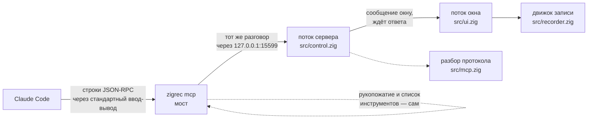
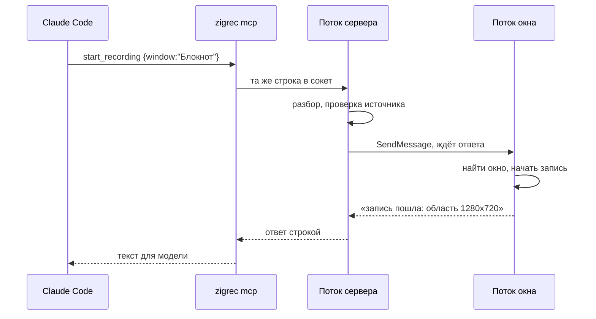

# Управление записью из Claude Code

Zig-Rec Studio принимает просьбы снаружи по протоколу MCP. Записью можно
управлять словами: «запиши окно браузера со звуком», «останови», «какой
получился файл».

## Включить

В окне есть кнопка **«Сервер MCP»**, рядом лампочка и адрес.

| Лампочка | Что значит |
|---|---|
| серая | выключен, порт закрыт |
| зелёная | слушает `127.0.0.1:15599`, рядом число исполненных просьб |
| красная | не завёлся, причина написана словами |

**Порт сам не открывается никогда.** Только по кнопке, и закрывается вместе
с окном. Слушается только `127.0.0.1` — наружу не выходит.

## Подключить

`.mcp.json` в корне проекта:

```json
{
  "mcpServers": {
    "zigrec": {
      "command": "C:\\путь\\к\\zigrec.exe",
      "args": ["mcp"]
    }
  }
}
```

## Что умеет

| Инструмент | Что делает |
|---|---|
| `start_recording` | начать: весь экран, монитор, прямоугольник `x,y,ш,в` или окно по части заголовка; со звуком или без; с частотой кадров |
| `stop_recording` | остановить и вернуть путь к mp4 |
| `recording_status` | идёт ли запись, сколько кадров и секунд, куда пишется |
| `list_monitors` | мониторы и их размеры |
| `list_windows` | видимые окна с заголовками |

Источник должен быть один. Прямоугольник и окно сразу — это не «оба»,
а неясность, и сервер отвечает отказом, вместо того чтобы снять не то.

## Как устроено



Три части, и каждая занята своим.

**Разбор протокола** (`src/mcp.zig`) — строка на входе, строка на выходе,
никакого ввода-вывода. Поэтому проверяется тестами, а не запуском.

**Окно слушает порт** (`src/control.zig`). Записывает по-прежнему окно —
то самое, которое видит человек. Сервер только передаёт ему просьбы, иначе
вышли бы две программы, снимающие экран одновременно.

**Мост** (`zigrec mcp`) — почти труба. Рукопожатие и список инструментов
он отвечает сам, не заглядывая в окно: клиент должен увидеть, что мы умеем,
даже когда окно закрыто. Иначе Claude Code при запуске решит, что сервера
нет вовсе.

### Кто что исполняет



**Исполняет всё поток окна.** Поток сервера принимает соединение, разбирает
строку и передаёт просьбу окну сообщением, которое ждёт ответа. Иначе запись
запускалась бы из одного потока, а останавливалась из другого, и однажды они
встретились бы на середине.

Каждому соединению — свой поток. Сначала разговоры шли по очереди, и один
подключившийся и замолчавший клиент держал всех остальных.

## Если что-то не так

**«Окно Zig-Rec Studio не отвечает».** Окно закрыто или кнопка не нажата.

**Лампочка красная.** Чаще всего порт занят второй копией программы.

**Ничего не происходит.** Проверьте сервер, не выходя из терминала:

```
zigrec mcp-smoke
```

Настоящий разговор из пяти шагов: рукопожатие, список инструментов,
состояние записи, список мониторов и заведомо неверная просьба. Каждый
ответ разбирается как JSON и сверяется по содержимому. Та же проверка
входит в общий прогон `tools\check.cmd`.
