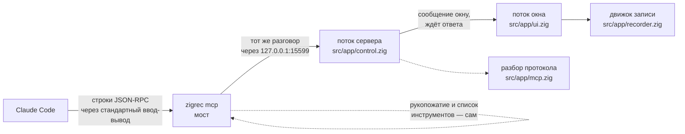
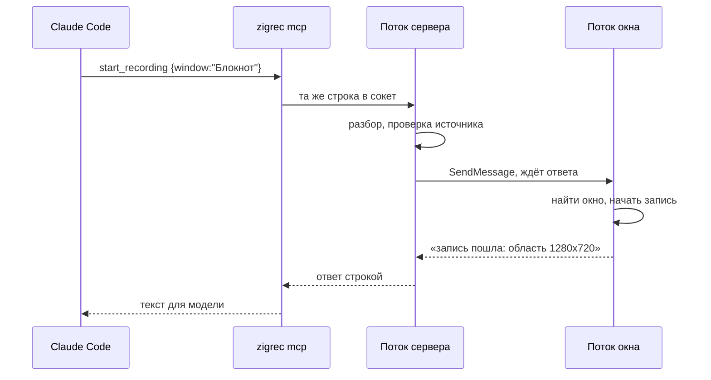

# Управление записью из Claude Code

Zig-Rec Studio принимает просьбы снаружи по протоколу MCP. Записью можно
управлять словами: «запиши окно браузера со звуком», «останови», «какой
получился файл».

## Включить

В окне есть кнопка **«Сервер MCP»**, рядом лампочка и адрес.

| Лампочка | Что значит |
|---|---|
| серая | выключен, порт закрыт |
| зелёная | слушает `127.0.0.1:15599`, рядом число исполненных просьб |
| красная | не завёлся, причина написана словами |

**Порт сам не открывается никогда.** Только по кнопке, и закрывается вместе
с окном. Слушается только `127.0.0.1` — наружу не выходит.

## Подключить

`.mcp.json` в корне проекта:

```json
{
  "mcpServers": {
    "zigrec": {
      "command": "C:\\путь\\к\\zigrec.exe",
      "args": ["mcp"]
    }
  }
}
```

## Что умеет

| Инструмент | Что делает |
|---|---|
| `start_recording` | начать: весь экран, монитор, прямоугольник `x,y,ш,в` или окно по части заголовка; со звуком или без; частота кадров, качество, поток, ключевые кадры, курсор в кадр или в слой; своё имя файла и своя папка; срок, по которому запись остановится сама |
| `stop_recording` | остановить и вернуть путь к mp4 |
| `pause_recording` | пауза и снятие паузы; `on` называет состояние, без него — переключает |
| `annotate_now` | надпись в слой событий прямо во время записи: свои слова или шаблон, цвет, сколько держать |
| `recording_status` | идёт ли запись: кадры, секунды, потери, путь захвата, размер кадра, качество, обратный отсчёт до самостоятельной остановки и путь к файлу |
| `project_info` | что в проекте `.zrs` (или каким проектом станет запись): исходники, дорожки с кусками, метки, аннотации, длительность и чем обойдётся экспорт |
| `project_edit` | резать проект и сохранить: `split`, `delete`, `ripple`, `compact`. Отмены нет — правится файл |
| `export_mp4` | собрать mp4 из проекта или вырезать отрезок записи; идёт **заданием** |
| `mixdown_wav` | свести звук в WAV; тоже заданием |
| `job_status` | как идёт задание: работает ли, сколько прошло, чем кончилось |
| `take_screenshot` | снимок экрана в png: весь экран, монитор, прямоугольник или окно; возвращает путь |
| `recent_recordings` | что записано и что открывалось недавно, и есть ли оно ещё на месте |
| `media_info` | что внутри файла: формат, длительность, дорожки, кодеки, размер кадра, играется ли mp4 с начала, есть ли рядом слой событий |
| `open_in_editor` | открыть запись или проект в окне редактора |
| `get_settings` | все настройки словами: папка и шаблон имени, кадры в секунду и качество, адрес и порт сервера, микрофон, автопанорама, разгон, язык, сочетание «обвести область», где лежат настройки |
| `set_settings` | поменять любое из них; меняется только названное, остальное остаётся как было. Сохраняется в файл сразу |
| `list_microphones` | микрофоны: номер устройства, имя, какой выбран |
| `probe_microphone` | проба на пять секунд: первый вызов начинает, следующие рассказывают, как идёт и каким вышел пик |
| `list_monitors` | мониторы и их размеры |
| `list_windows` | видимые окна с заголовками |
| `recording_events` | события последней записи из слоя рядом с ней: движения и клики мыши, клавиши, смена окна — со временем в секундах |

Источник должен быть один. Прямоугольник и окно сразу — это не «оба»,
а неясность, и сервер отвечает отказом, вместо того чтобы снять не то.

## Протокол

Версия протокола не наша, а клиентская: он называет свою при рукопожатии, и
если мы её знаем — отвечаем ею же. Знаем `2025-11-25`, `2025-06-18`,
`2025-03-26` и `2024-11-05`; не знаем названной — отвечаем своей новой, и
дальше решает клиент. Отвечаем также на `ping`, а на уведомления (сообщения
без номера, вроде `notifications/cancelled`) не отвечаем ничем — по
JSON-RPC ответ на уведомление и есть ошибка.

## Долгие дела — заданием

Окно обслуживает просьбы в своём потоке сообщений. Делать в нём что-то долгое
нельзя: окно замрёт, и Windows напишет «Не отвечает» — так и было на «Стоп»
(#102). Поэтому экспорт и сведение уходят в свой поток, а просьба получает
ответ сразу; `job_status` рассказывает, как идёт и чем кончилось. Задание одно
на окно: пока одно идёт, второе не начнётся.

## Как устроено



Три части, и каждая занята своим.

**Разбор протокола** (`src/app/mcp.zig`) — строка на входе, строка на выходе,
никакого ввода-вывода. Поэтому проверяется тестами, а не запуском.

**Окно слушает порт** (`src/app/control.zig`). Записывает по-прежнему окно —
то самое, которое видит человек. Сервер только передаёт ему просьбы, иначе
вышли бы две программы, снимающие экран одновременно.

**Мост** (`zigrec mcp`) — почти труба. Рукопожатие и список инструментов
он отвечает сам, не заглядывая в окно: клиент должен увидеть, что мы умеем,
даже когда окно закрыто. Иначе Claude Code при запуске решит, что сервера
нет вовсе.

### Кто что исполняет



**Исполняет всё поток окна.** Поток сервера принимает соединение, разбирает
строку и передаёт просьбу окну сообщением, которое ждёт ответа. Иначе запись
запускалась бы из одного потока, а останавливалась из другого, и однажды они
встретились бы на середине.

Каждому соединению — свой поток. Сначала разговоры шли по очереди, и один
подключившийся и замолчавший клиент держал всех остальных.

## Если что-то не так

**«Окно Zig-Rec Studio не отвечает».** Окно закрыто или кнопка не нажата.

**Лампочка красная.** Чаще всего порт занят второй копией программы.

**Ничего не происходит.** Проверьте сервер, не выходя из терминала:

```
zigrec mcp-smoke
```

Настоящий разговор из пяти шагов: рукопожатие, список инструментов,
состояние записи, список мониторов и заведомо неверная просьба. Каждый
ответ разбирается как JSON и сверяется по содержимому. Та же проверка
входит в общий прогон `tools\check.cmd`.
